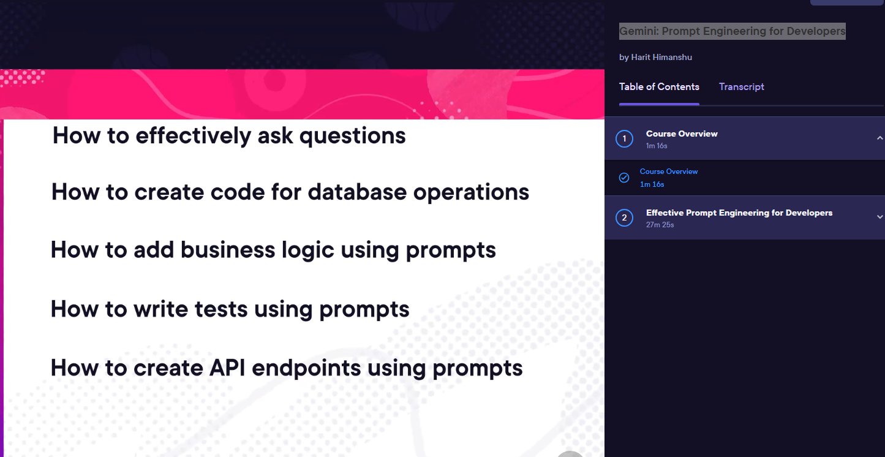
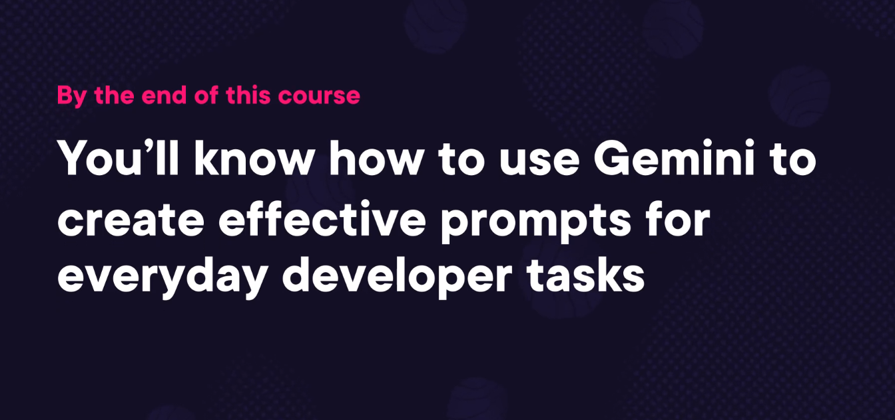

Gemini-Prompt Engineering For Developers
- How to effectively ask questions
- How to create code for database operations
- How to add business logic using prompts
- How to write tests using prompts
- How to create API endpoints using prompts

By the end of this course You’ll know how to use Gemini to create effective prompts for everyday developer tasks
