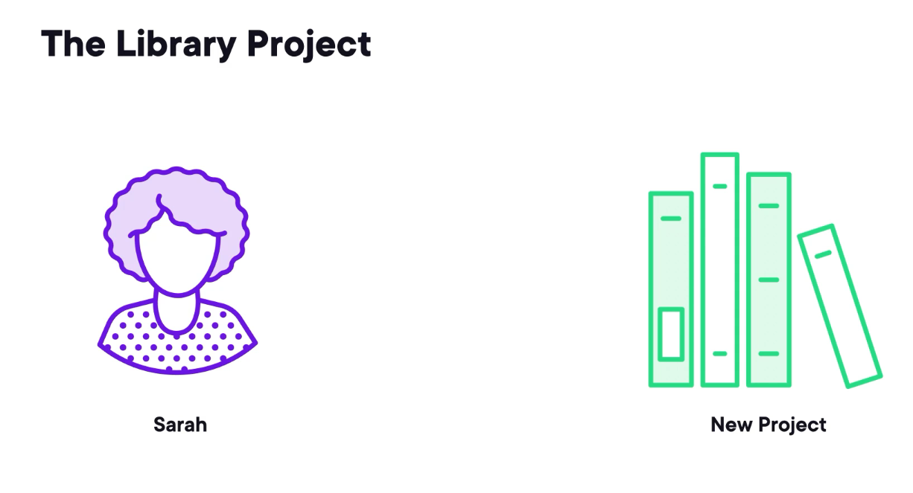
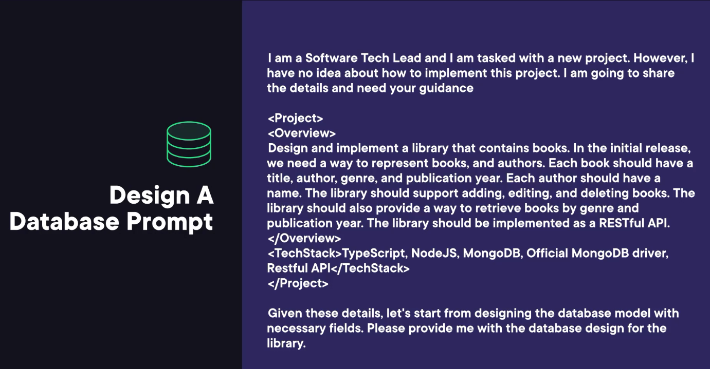

Gemini is a family of multimodal large language models developed by Google DeepMind. When I say multimodel, it means it is capable of understanding more than text. 

 For example, in this Gemini prompt, you can also provide an image and talk to the model about that image. 

 Apart from being multimodel, Gemini is capable of writing code.

* Desigining Database
* writing Business Logic
* writing Tests
* Creating Restful API

- Requirements
    - Need to Design a Database Model
    - how to create models and DB interaction layer in the technology of here choice.
    - find out how to write business logic.
    - test the business logic for correctnerss
    - finding how to create APIs so that is open to world to create and manage books

In The Prompt; 
<Role>
    Give The Role as initial Context
</Role>
<Project>
    <Overview>
     Project Description
    </Overview>
    <TechStack>
    </TeckStack>
</Project>
<OutCome>
-- provide the Database Design
</outCome>

### Step 1: Design A Database Prompt

Role: 
I am a Software Tech Lead and I am tasked with a new project. However, I have no idea about how to implement this project. I am going to share the details and need your guidance.

<Project>
  <Overview>
    Design and implement a library that contains books. In the initial release, we need a way to represent books and authors. Each book should have a title, author, genre, and publication year. Each author should have a name. The library should support adding, editing, and deleting books. The library should also provide a way to retrieve books by genre and publication year. The library should be implemented as a RESTful API.
  </Overview>
  <TechStack>
    TypeScript, NodeJS, MongoDB, Official MongoDB driver, Restful API
  </TechStack>
</Project>

Given these details, let's start from designing the database model with necessary fields. Please provide me with the database design for the library.

Visiting gemini.google.com

and pasting above cotent

Gemini Response

### Step 2: Writing Database Model Prompt

Entering Above Test for Gemini:

As a next step, Help me create the necessary code to perform CRUD operations on the database. This includes the model files, and the necessary functions to add, edit, and delete books. Please provide me with the code for these operations.

Gemini Response

