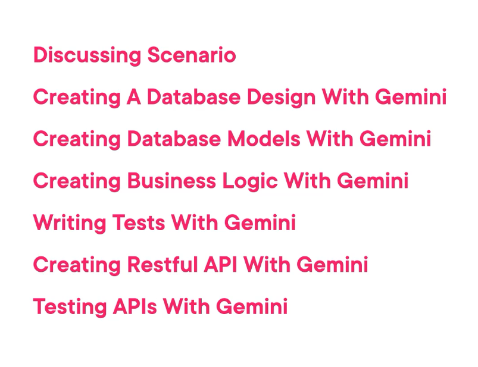
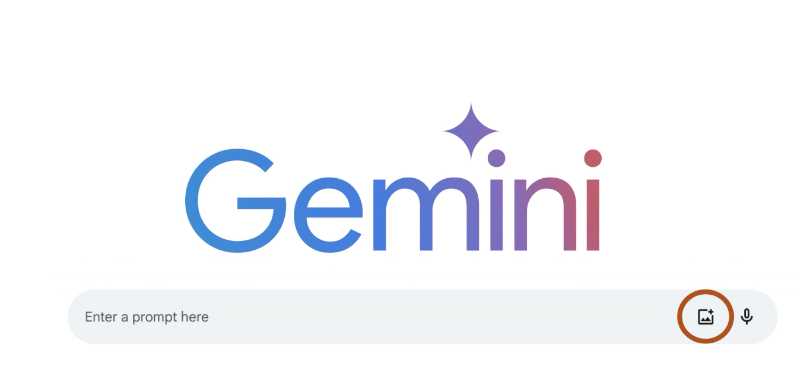
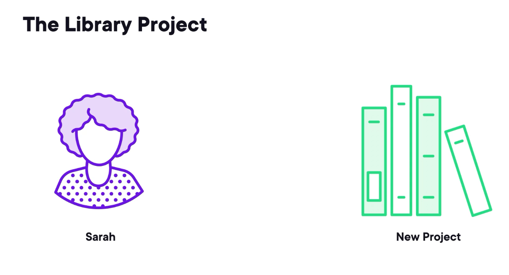

Gemini is a family of multimodal large language models developed by Google DeepMind. When I say multimodel, it means it is capable of understanding more than text. 

 For example, in this Gemini prompt, you can also provide an image and talk to the model about that image. 

 Apart from being multimodel, Gemini is capable of writing code.

